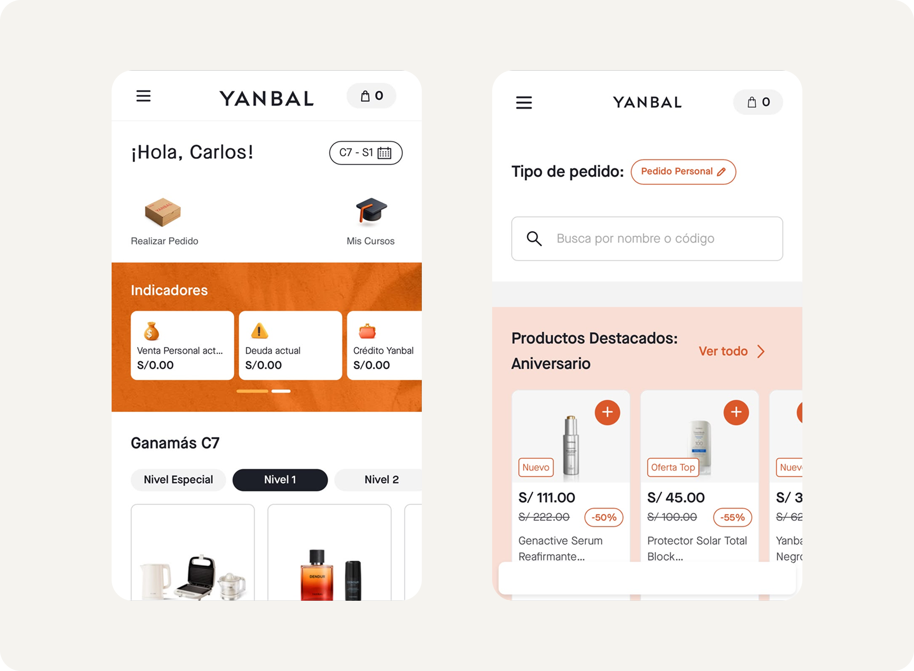

## The Problem

Yanbal had spent 3 years building its new commercial system, **New MAYA**, alongside satellite products like Pase de Pedido. MAYA already had 2 years in production, with visual improvements and new features layered on top, and Pase de Pedido — though interconnected — worked as a separate box.

Design lived in order in Figma, but that order broke down when it crossed over into development. UI Kit v0.2 wasn't an actionable source of truth: each development team took the layouts and rebuilt, on its own, a component library for its own product. Every atom, molecule, and organism ended up *hardcoded* and out of sync with each other.

The cost was concrete and recurring:
- Visual inconsistencies between products that shared a brand.
- Long visual QA cycles to catch and fix those differences.
- Constant overwrites that multiplied maintenance work.

I started by leading the UI front of the Design team: governing the UI Kit and meeting with UI designers and Product Designers to standardize components and features across products and teams. As the project took shape and scale, my role evolved into Design System Manager + UI Lead, coordinating a mixed Yanbal–Propelland team of 9 people across design, tokens, and development disciplines.



## The Process

We structured the project into 4 phases over ~25 weeks:
1. **Audit (4 weeks).** We assessed the real state of the UI Kit in Figma, identified areas for improvement, and built a pipeline prototype to validate technical feasibility before committing the investment.
2. **Setup, strategy, and governance model (3 weeks).** We defined documentation guidelines, the system's semantic structure and naming, the governance model, the measurement plan, and the tokenization roadmap.
3. **Token design and pipeline implementation (8 weeks).** We designed the Foundation, Semantic, and Component tokens; tokenized the components; and inventoried illustrations and icons. The Yanbal team applied improvements in parallel.
4. **Component development and npm pipeline (10 weeks).** We built the components in Stencil.JS and the packaging and publishing pipeline as an npm package.

## Key Architecture Decisions

**Three token levels (7 libraries): Primitive → Semantic → Functional.** Separating tokens by semantic level and function let the system scale without collisions, and let a brand change cascade through automatically. We designed a custom naming convention, `--fry-p-*`, `--fry-s-*`, `--fry-f-*`, with cascading aliases between levels.

**Tokens Studio + Style Dictionary + Azure DevOps.** We chose Tokens Studio because it lets us gatekeep changes before they enter the Azure DevOps repo; Style Dictionary translates those tokens into three files — Foundation.css, Semantic.css, and Component.css — ready for use in code.

**Centralized governance model.** Yanbal is a single brand, with no sub-brands, and FrYDA was conceived to be the standard for 100% of digital products. A centralized model was the most efficient way to govern that ambition.

## The Hardest Challenges

1. **Reworking inherited semantics.** The UI Kit carried semantic and syntax errors: confusing variant and property names that invited mistakes. We adopted the principle that every variant should name its intended use, and designed components so a designer couldn't apply them incorrectly. This forced us to rework color semantics multiple times and iteratively create new tokens. Inventorying and analyzing component usage across products was also demanding work.
2. **Angular in a React world.** The market standard is React, but Yanbal requires Angular across all its products. We looked for the best technical solution and chose Stencil.JS to generate framework-agnostic web components. Angular remains a challenge: certain framework protocols have required us to adjust configurations and ways of building components along the way.


```html
<fry-button hierarchy="primary" mode="default" text="Download" icon-left="download-outline" type="button">Download</fry-button>
```

## Results and Impact

Today FrYDA is an **npm package v1.5.0 with 34 functional components** and living documentation in Zeroheight covering foundations, components, accessibility (WCAG), UX writing, and governance.

The first product built entirely from scratch is already built fully on top of FrYDA. Once it enters production, MAYA will adopt every component that product uses, with a projected impact of:

- 30-40% less development time through reuse.
- Faster, more efficient visual QA for every product team.
- A single base that eliminates rebuilding libraries per product.

The remaining metrics will keep being gathered as adoption progresses. The evolution roadmap includes 10 additional components, improvements to existing ones, and rolling out a contribution model from each product back into the system.

## What I Learned

>This project pulled me out of my UX/UI Designer role and connected me to the technology layer of the product. I went from knowing only HTML and CSS to working with JavaScript, Stencil.JS, Git/GitHub, pipelines, and versioning — truly understanding how a design decision becomes maintainable code.
>Just as important: I sharpened my role as a project and product leader, measuring business impact and making sure every cent and every second invested in FrYDA had a real commercial return for Yanbal.